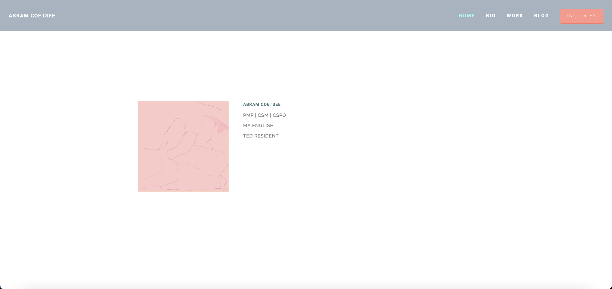
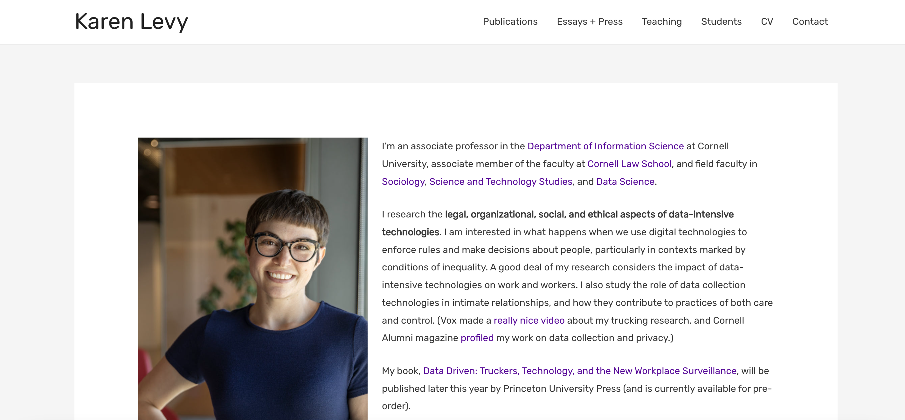
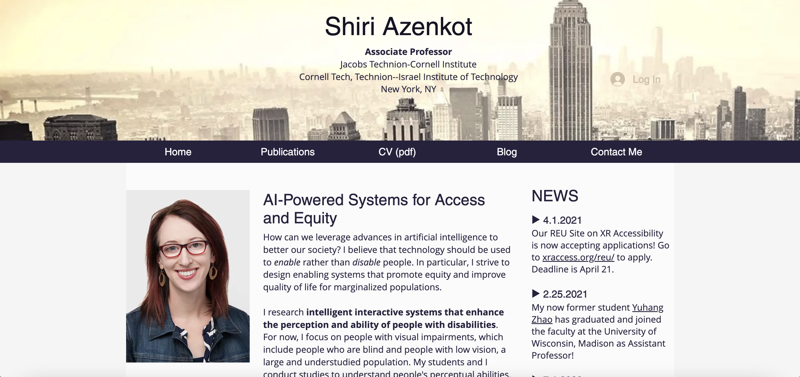
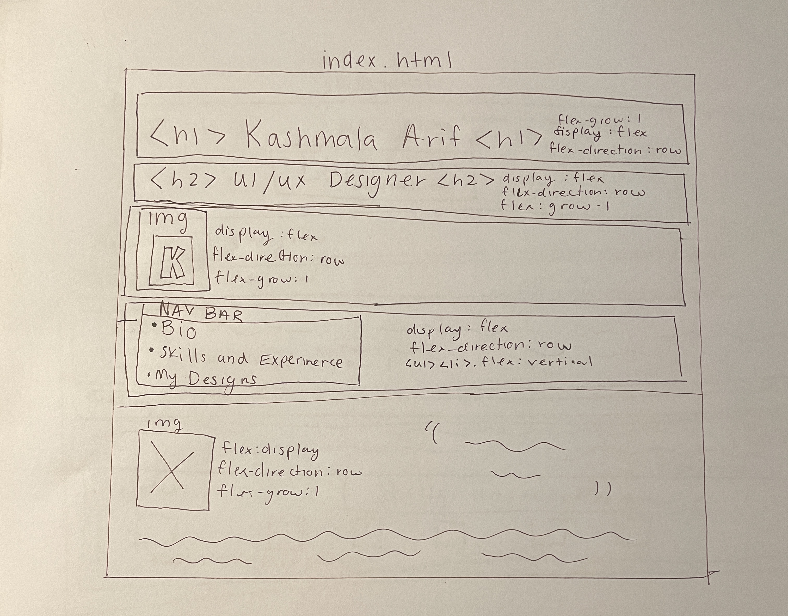
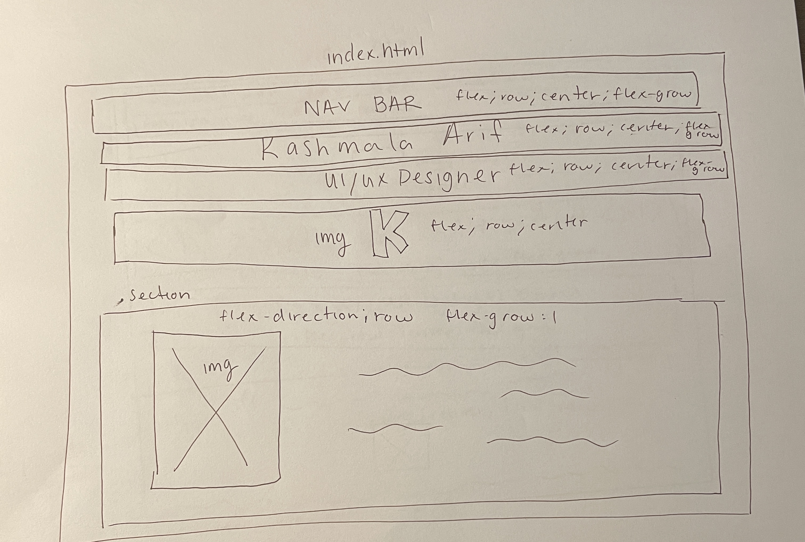
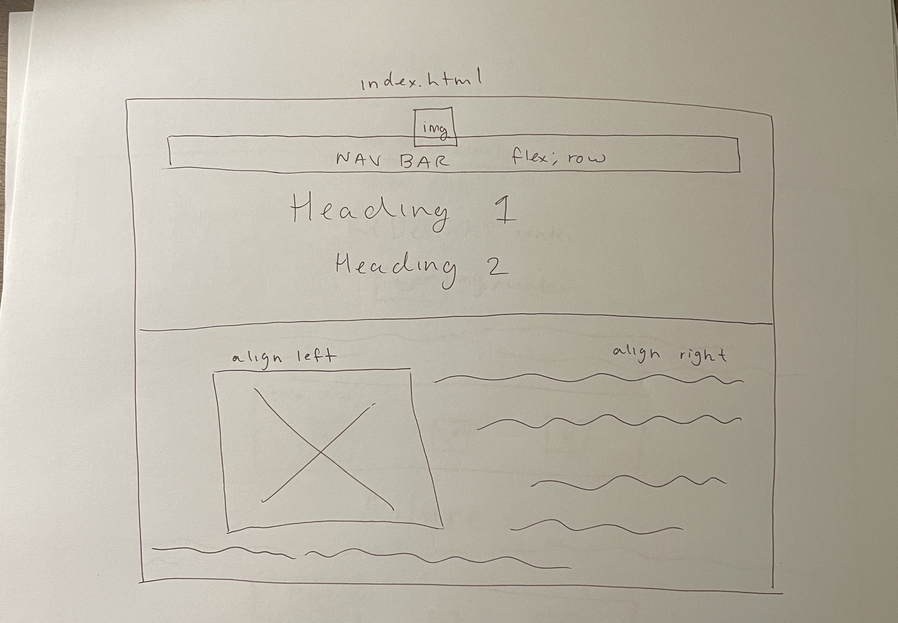
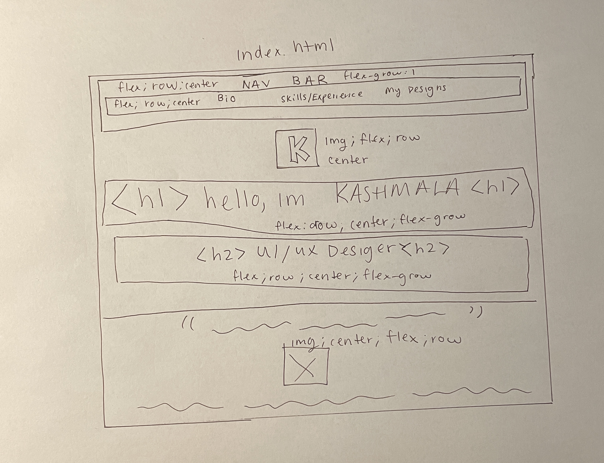
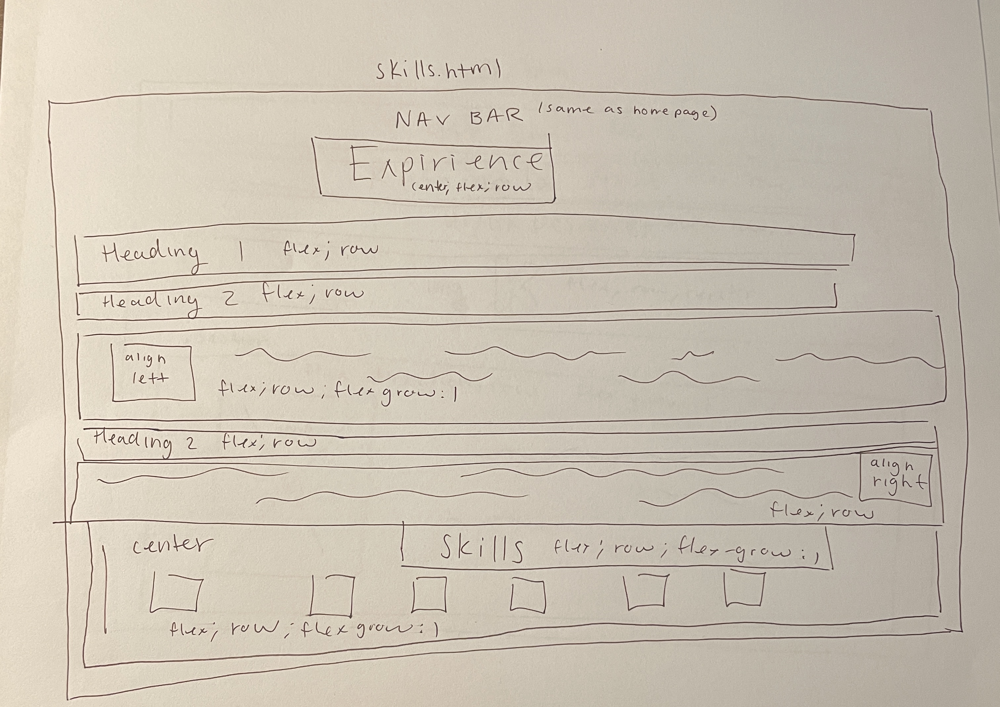

# Project 1: Design Journey

**For each milestone, complete only the sections that are labeled with that milestone.** Refine all sections before the final submission.

You are graded on your design process. If you later need to update your plan, **do not delete the original plan, leave it in place and append your new plan _below_ the original.** Then explain why you are changing your plan. Any time you update your plan, you're documenting your design process!

**Replace ALL _TODOs_ with your work.** (There should be no TODOs in the final submission.)

Be clear and concise in your writing. Bullets points are encouraged.

**Everything, including images, must be visible in _Markdown: Open Preview_.** If it's not visible in the Markdown preview, then we can't grade it. We also can't give you partial credit either. **Please make sure your design journey should is easy to read for the grader;** in Markdown preview the question _and_ answer should have a blank line between them.

## Personal Site (Milestone 1)

### Website Topic (Milestone 1)
> Briefly explain what your website will be about. Share your vision of your personal website.
>
> My website will be a portoflio of different UI/UX designs I have made. I would like to explain my inspiration and motivaion for my different designs, as well as information about who I am and my goals.

### Device (Milestone 1)
> How you will your audience likely access your website? On a laptop/desktop computer or a mobile device?
> You will design your website for mobile or desktop devices (not both).
>
> I will be designing my website for a desktop site.

## Personal Website Design Exploration (Milestone 1)

Identify three personal websites (preferably static websites) that exist today on the web. You will be drawing inspiration from these sites for your own site; please select websites that are similar to the website you wish to create.

Include a screenshot of the home page for each site. If you're planning a mobile website, your screenshots should be from a mobile website. If you're planning a desktop website, your screenshots should be from a desktop website.

**We'll refer to these are your "example websites."**

> 1. <https://www.abramcoetsee.com/>
> 
> 2. <https://www.karen-levy.net/>
> 
> 3. <http://shiriazenkot.com/>
> 

### Personal Website 1 Review (Milestone 1)
> Review the personal website you identified above. (1-2 paragraphs)
>
> - Who do you think this site is designed for? Who is its intended audience?
> - What **goals** do you think the audience likely has when visiting this site.
> - What **content** is included?
> - Do you believe the content likely **addresses** the goals of the site's audience?
> - What do you like about the design?
> - Is the site designed for desktop, mobile, or desktop and mobile devices?
>
> The site is purposefully designed for people who want to see the graduate student's work and career goals. The intended audience may be employers, friends, or other coworkers. I believe the goals of the audience is too see his past and current work, what he has to offer, and get a better understanding of who he is. The content definently addresses these goals, as he has all of his work laid out properly, which is one thing I admire about this website. Abram has thorough and fully detailed projects, meaning the audience can easily see his progress and follow step by step. Considering that there is a lot of content, pictures, descriptions and different pages, this website was most likely designed for a desktop.

### Personal Website 2 Review (Milestone 1)
> Review the personal website you identified above. (1-2 paragraphs)
>
> - Who do you think this site is designed for? Who is its intended audience?
> - What **goals** do you think the audience likely has when visiting this site.
> - What **content** is included?
> - Do you believe the content likely **addresses** the goals of the site's audience?
> - What do you like about the design?
> - Is the site designed for desktop, mobile, or desktop and mobile devices?
>
> The site is designed for people interested in Karen's work, such as employers, coworkers, or students who enjoy learning about information science.The goals of the audience  when visiting this website is to know what Karen has accomplished so far. Karen's website is very text heavy, rather than images. What I like about the design is that everything is organized very nicely and you can easily find her different works. For example, she  posted all of her lectures, discussions, and publications into categories that you can easily click on them.  Given that her website is simpler than other portfolios, this website could be designed for desktop and mobile devices, as it would be easy to look around on the website.

### Personal Website 3 Review (Milestone 1)
> Review the personal website you identified above. (1-2 paragraphs)
>
> - Who do you think this site is designed for? Who is its intended audience?
> - What **goals** do you think the audience likely has when visiting this site.
> - What **content** is included?
> - Do you believe the content likely **addresses** the goals of the site's audience?
> - What do you like about the design?
> - Is the site designed for desktop, mobile, or desktop and mobile devices?
>
> This site was designed for people interested in getting contact with Shiria and to learn more about her work and career. The goals the audience has is to know how qualified she is in her career and what she has accomplished. Her content includes her resume, cover letter  contact information, and accomplishments. This content does meet the goal's of the audience, as they have access to her email, past work, and biography. What I like about this design is that she is very forward with showing her audience what she has to offer and easy access to her contact information. This site is designed for desktop and mobile devices due to the website being text heavy and not many images.

## Audience & Goals (Milestone 1)

Using what you learned from studying the example websites, identify your website's audience and their goals.

### Audience (Milestone 1)
> Briefly explain who the intended audience is for your website. Be specific and justify why this audience is appropriate for your site's topic.
>
> The intended audience for my website are employers and other students interested in seeing my UI/UX designs and projects. My page specifcally talks about my career path and is a place to showcase my work/talent. This is why I believe my intended audience, such as employers, is the appropriate audience for my site because my content will be geared towards impressing them.

### Audience Goals (Milestone 1)
> Why would your audience visit your site?
> Identify at least 3 goals that your users have for visiting your website.

1. Want to learn more about who I am and my inspiration

2. Interested in my past work and talent

3. Looking to contact me

## Content Planning (Milestone 1)

Plan your site's content.

### Your Site's Planned Content (Milestone 1)
> List **all** the content you plan to include your personal website.
> You should list all types of content you planned to include (i.e. text, photos, images, etc.)

- Text: Autobiography
- Photos of my designs
- Descriptions of my designs
- Link to my resume
- Photo of myself
- Logo
- Contact Information (Email, LinkedIn)

### Content Justification (Milestone 1)
> Explain (about a paragraph) why this content is the right content for your site's audience and how the content addresses their goals.
>
> This content is the right content for my site's audience because it provides the audience with everything I want to deliver to them. I believe these content choices will meet the audnence's goals since they will be able look at my creativity, and if they really like what I do, they can contact me or learn more about who I am.

### Home Page Content (Milestone 1)
> What is the content that your users would expect when visiting your site for the first time.
>
> The content my users would expect when visiting my site for the first time is my name,  what kind of designs I make, and who I am. Because of my career field, they might also expect an eye-catching portoflio when first visiting the site itself.
>
> Briefly identify what content you will include on the homepage and why this content should be the first thing your target audience sees when they visit your site.
>
> The content I will include on the homepage is my name, my career title/what I work as, a picture of myself, my logo and a brief description of who I am. This should be the first thing my audience sees so they know what this page is about. They can get sense of who I am before looking through my other, more detailed content.

## Information Architecture (Milestone 2)

For milestone 2, you will design the information architecture for all the pages your website.

You may change your homepage content based on your card sorting. If you do change the homepage content, don't update it above, just include the new plan in the section below (Content Organization).

### Content Organization (Milestone 2)
> Document your **iterations** of card sorting here. You must have at least 2 iterations of card sorting.
> Include photographic evidence of each iteration of card sorting **and** description of your thought process for each iteration.
> Please physically sort cards; please don't try and do this digitally.
> 
> 1. In the first iteration I split my content into two sections, where the first section was primarly for learning about who I am. That is why included my autobiography, a photo of myself, my resume, and contanct information. In the second grouping, I placed content that had to do with my work, desgins, and skills. In this card sorting there is a lot of content placed together as well.
> 
> 2. In the second iteration I decided to split my content into more categories. In my mind, I saw that I should have the space for my desgins and descriptions on their own. My designs will be enough content for one page and I decided there is no need to put other content with it. I also decided that my skills and resume can go together on a separate page. The last group my content was more focused on me and introducing myself more like a brand, which is why I decided to put my logo with photo, decription, and contact information.
> 
> 3. in the third iteration I decided to add a few more cards. I believed adding these cards made a huge difference in how my website will be presented. I added my name and profession title to the "Biography" group and also decided to add my experiences to the "Resume and Skills" group. I belive this is much more cohesive for my audience as they can get a better understanding of why I am creating my website.

### Final Content Organization (Milestone 2)
> Which iteration of card sorting will you use for your website?

I plan to use the third iteration of my card sorting. I believe it is much more organized and well thought out.

> Explain how the final organization of content is appropriate for your site's audiences.

This organization makes more sense for my audience because the strcture of my content in the third iteration will allow me to sell myself to employers, which is my main audience. For example, putting my logo that I created and profession title on my homepage will show my audience that I am branding myself and that I am a creative designer. Additionally, this organization shows that I want my audience to focus on my designs, which is why I placed them into their own category. By doing this, it also shows my audience how important my design and design processes are and how dedicated I am to showing them my talent. In another grouping, I decided to add my experinces along with my resume and skills to give the reader a better overview of what my capabilties are.

### Navigation (Milestone 2)
> Please list the pages you will include in your website's navigation.

- page 1: Bio
- page 2: Experience and Skills
- page 3: My Designs

> Explain why the names of these pages make sense for your site's audience.

These name pages make sense to my audience because it summarizes everything into one word. It will be easy for them to naviagte the website and find what they are looking for. If they want to know about me, they can click "Bio." If they want to know my skills it can be seen in "Experiences and Skills." To see my own designs and talent they can click the "My Designs" page. This set up is perfect for my audience as it allows them to see what they need to in a simple way.

## Visual Themes (Milestone 3)

**Make the case for your decisions using concepts from class, as well as other design principles, theories, examples, and cases from outside of class.**

Remember to focus on the things we can't see just by looking at the site: changes, alternatives considered, processes, and justifications.

Each section is probably around 1 reasonably sized paragraph (2-4 sentences).

### Theme Ideas (Milestone 3)
> Discuss several (more than two) ideas about styling your site's theme. Explain why the theme ideas are appropriate for your target audiences.
>
> Theme 1: Professionlism + Creative
>
> Color: light purple, light pink and black
>
> Typography: Times New Roman Text and Bold Text
>
> Imagery: transparent backgrounds
>
> Sharp Borders
>
> For my theme I am going with a more aesthetic and welcoming feel. I want to use light colors like ligh pink, purple, white, and etc. I believes this will contribute to my aesthetic and give a softer touch to the website. However, I want to present myself as a professional employee as well. Therefore, I want to creat borders that are sharp.  I believe this would be appropriate for employers looking at my website. I do not want my website to be completely fun and lively, as I want to keep some professionalism with the sharpbroders and a black color pallette option.

> Theme 2: Fun and Lively
>
> Color: purple, pink, black, white,
>
> Typography: Ariel Narrow Font, Hand-written fonts
>
> Imagery: rounded
>
> Borders: Rounded
>
> In this theme I want to create a light hearted and fun design. The colors I chose bring a lively aspect to the website and the rounded images and borders would show that as well. I believe this would be appropraite for my audience because I want to express a creative side to my employers and try to stay aeay from being as boring as possible.
>
> Theme 3: Professional and Sharp
>
> Color: black, white, gray
>
> Typography: Times New Roman
>
> Borders: Sharp
>
> In this theme I can create a website thst is very professional. With sharp lines and black, white, and gray shades I can create a website where I am simply displaying my skills and talent. I believe this would make sense for my target audience because my website would be viewed in business settings. I would need to be shown as a professional individual.

### Final Theme (Milestone 3)
> Which theme did you select as your final theme? Why?
>
> I chose the first theme because I believe it is a good mixture of the other two themes combined. I did not want my website to look very serious but niether did I want to come off as unprofessional. This is because when my target audience sees my website they want to see that I am creative as well as organized and collected. If I am able to make the website to show both, I believe that is the best theme.

### Theme Rationale (Milestone 3)
> Discuss your final theme design: how do they fit your overall design goals and audiences?
>
> My final theme design fits in my overall design goals and audiences because it maintains a professional yet lively and creative design. My audience, which are employers, do not want a plain website that has no color, but they also do not want to see a bubbly and colorful site if they want to take me seriously. I believe the typography chosen is important in this case because a more hand-written font can come off as less professional, compared to typewrite-based fonts.

> Emotion is a big part of design. What emotions were you thinking about or trying to convey in your designs?
>
> The emotions I am trying to convey are creative, inquisitive, and inpsiring. I want my audience to be interested in my website and be amused in regards to my portfolio. I want them to feel happy as they are scrolling through the website as well. I do not want them to be serious and bored, which is why I believe the professional theme would have not worked in my favor.

## Layout & Composition (Final Submission)

### Home Page Layout (Final Submission)
> Include several sketches of possible layout ideas for the home page.
> Provide an explanation for each sketch explaining the idea.
> Show your design process.
> **Use the example websites above as inspiration for your site's design.**
>
>  
>
> 1. In this sketch, I focused on what needs to be in a flex box. This first sketch helped me understand where my website currenlty looked like and what I can do to change the format and style. There is not much rearranging in this sketch, but this helped me organize my content more.
>
> 
> 2. In this sketch I started to move things around and place things in different orders. For instance, I moved my navigation bar all the way to the top. In this sketch I also centered everything to give it a cleaner look. I also placed the text to the left of my image by adding a flexbox.
>
>  
> 3.In my third sketch I tried a new design where I placed my logo above everything, including the navigation bar. The reason for this was to make the site look more professional, as many websites put their brand logo at the very top. Addtionally, I wanted to align my text to the right instead of making a flex box, as well as aligning the image to the left.

### Final Site Design (Final Submission)
> Include a sketch of the final layout for each page in your site.
> Provide an explanation below each sketch.
>
>
> 1.In my final sketch I started to move things around to create a more clean look. I placed my logo above my headings, but below the naviation bar. I also changed the way my content would be layed out underneath everything. I used a flex box and put the image in the center with text underneath it. I also added a blockquote to the top of the image. I made sure to center almost everything on this page, as it gave a clean, neat look to my website.
>
> 
> 2.In my final sketch for the skills page, I swithced up the format from the index page. In this page I aligned my text to either the right or left, as well as my images. At the bottom of this page I used a flexbox to put images of my skills in a row. The skills section is also centered.

### Static Website Design Check (Final Submission)
> We're building a static website without interactivity.
> **No part of your website may dynamically change.**
> Examples of dynamic behavior are dropdown menus, hamburger menus, popups, modals/lightboxes, image carousels, etc.
>dfd
> Audit your design and check that you aren't relying on any dynamic features.
>
> My design is completely static because everyone who visits my webpage will see the same thing. Additionally, there are no buttons like dropdown menus, hamburger menus, popups, lightboxes, or image couresels as well as no interactivity using java. Everything is stationary, and the html code in my content is fixed. Lastly, none of my pages relay on dynamic features, as you can naviagte to different pages by simply clicking the navigation bar.

## Rationale (Final Submission)

**This rationale should be polished writing:** one you might submit as a report to a client or boss to help explain the project and convince them you did a good job. You'll be surprised how much writing and communicating you need to do about projects and choices on internships and jobs; practice that here.

It should be a comprehensive, complete story of the project. You might find that each section runs a few paragraphs (1-2). Sketches can often help tell the story of your design. Screenshots are also useful for describing issues discovered during the design process and how you addressed them.

**All images must be visible in "Markdown: Open Preview" for credit!**

Your rationale should be a polished version of the earlier explanations.

### Audience (Final Submission)
> A complete and polished description of the intended audience(s) for your website.
>
> My intended audience for this website are people in the digtial design industry, specfically people who can provide me with future jobs, oppurtunities, and experiences. This includes employers, coworkers, peers, and overall, people in my academic enviorment. This website is not targeted torwards people outside of my perspective career field. Rather, I want to attract people who are professional in my industry, which is why my website displays a more fun, and creative, which is seen as professional in my respective career field.

### Design Goals (Final Submission)
> An explanation of the design goals for that audience, based on your earlier rationales.
>
> Based on my earlier rationales, I believe my design goals were appropriate for my intended audeince. My overall design goal was to create something creative and unique, to show that I am professional in my work. Becasue my intended audience are people in the digital design industry, I did not want to create something plain that followed the standard rules of "professionalism". Professional in my sense was to design a website that was eye-catching, creative, and put together. This is why I decided to use light colors in my website, to display a clean and minimilistic look. I believe the light pink background helped show that I am creating something more fun rather than if I used white, which could show that I am creating something more serious and resume-like. However, to keep that sense of standard "professionalism" I decided to use regular text font such as "times new roman." I believe this helped meet my design goal because I did not want my website to look bubbly, but moreso put together,neat, and aesthetic.
>
> To meet the unique aspect of my design goal, I decided to stray away a little from the portfolio's I analyzed in the beginning of this project. Although I followed most design techniques from the websites, such as lighter colors and images of myself, I decided to create my biography page a little differently. My home page was designed if it were a scrapbook, where I had a big title labeling my name and profession and with multiple image that had no background. I believe this added some creativity to my website, as I wanted to stand out from other people. Overall, I believe designs did follow the normal creative, modern, and aesthtically pleasing websites I have seen, which shows my professionalism. However, I also wanted to design something a little more unique, which is why made my home page eye-catching, which can intrigue my intended audience.

### Content Organization & Navigation (Final Submission)
> An explanation of how the final content organization and navigation met your goals and why it's appropriate for your audience.
>
> My final content orginization and navigation met my goals and makes sense for my audience. I organized my content into 3 pages, "Biography", "Experience and Skills", and "My Designs." These three categories cover everything someone needs to know about me in the work industry. Starting off with the the "Biography"/home page, I wanted to show my audience who I am and what my mindset is like. In this page I am able to let the audience know my name, school, my profession, personality, and etc. I decided to do this because it is important for employers to know who you are besides your work and talent.
>
> In my second page, the 'Experience and Skills" navigation tool, helps me explain my qualifications and what I know. I would like my audience to see this because I want to convey that I am a hard worker. Putting my skills and experience together was the best way to organize my content because the skills I learned could be applied to my future jobs and experiences.
>
> My final page, "My Designs" was the most important page of my website becasue it truly displays all the work I know how to do in the digital design industry. This is why I gave it its own page. I believe this is important for my audience because they would like to clearly see all of my personal work and how motivated I am to create my own projects.

### Visual Design (Final Submission)
> An explanation of how the final design met your goals and why it's appropriate for your audience.
>
> The intended audience for my website are employers and other people in the digital desing indsutry who are interested in seeing my UI/UX designs and projects. My page specifcally talks about my career path and is a place to showcase my work/talent. This is why strcutured my site into three webpages, a biography, a skills and experience page, and the designs I have previously made. These summarize what my audience needs to know about me very well. Addtionally, to showcase my creativity I chose go with a soft-aesthetic look, with normal font-families and light colors. I picked these style choices because I did not want something too bright and colorful or plain and boring, as niether are appropriate for my audience. Additionally, the placement of my content also flows very well. The images are placed as figures to their respective text and vice versa. Overall, the best way to show my professionalism to my audience was to create a website with a minimilistic, clean and creative theme, which I was able to accomplish.

### Self-Reflection (Final Submission)
> Take some time here to reflect on how much you've learned since you started this class. It's often easy to ignore our own progress. Take a moment and think about your accomplishments in this class. Hopefully you'll recognize that you've accomplished a lot and that you should be very proud of those accomplishments!
>
> Before this class, I knew nothing about linking pages, HTML, or CSS. I learned a lot about how to structure a website using HTML and what you should use in CSS vs HTML. One thing I comprehended very well was why we have "best practices" in HTML and CSS. For example, I began to use the strong and bold element in HTML, however when I started to style in CSS, it messed up the vision I had and everything became more complicated. I realized why we leave the styling attributes to CSS, and to only use HTML for structure. On the other hand, I knew more about desinging website and user interfaces. I had a smaller learning curve for this process, but I did learn how to organize navigation bars for users. This was hard to organize because I had a lot content and did not know where to start at first. But after grouping and creating names for my pages, everything became much easier. Overall, I did not think that I would create my first website this quickly, coming in knowing nothing about HTML or CSS.

## Grading (Final Submission)

### Mobile or Desktop? (Final Submission)
> Should the graders, grade your site as a desktop site or a mobile site?
>
> Desktop

### Grading: Open the Design Journey in Markdown: Open Preview (Final Submission)
> Preview your design journey in VS Code. Please verify that this document is easy to read/grade.
>
> - Remove all _TODOs_
> - All images must be visible.
> - All images must be oriented the correct way.
> - There should be a blank line between the question prompt and your answer.
>
> Is your design journey easy to read?
>
> Yes

### Collaborators
> List any persons you collaborated with on this project.

### Resources
> Please cite any external resources you used in the creation of your project.
>
> https://developer.mozilla.org/en-US/
